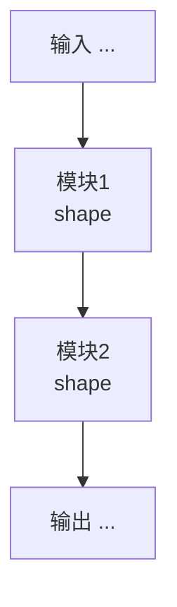
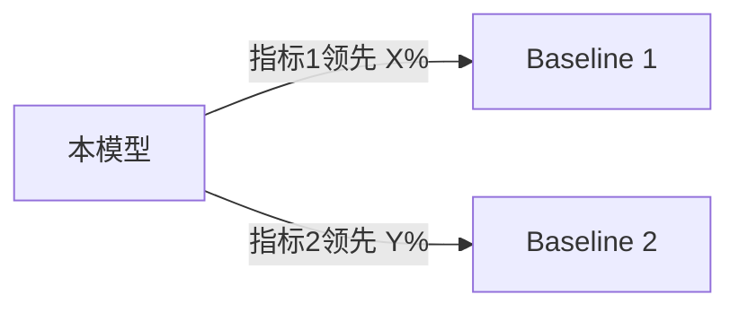

# 论文理解文档：{论文标题}

> 论文来源：{arXiv/会议链接}
> 官方代码：{GitHub 链接，若无则填"无官方代码"}
> 文档版本：v1（首次生成，待人工确认）

## ⚠️ 待人工确认的关键缺口（检查点①重点关注）

> 在完成全文填写后，回到这里汇总所有标注为【AI推断补全】或【论文未提及】的关键项，按重要性排序列出。这是给审阅者的"导航条"，避免审阅者需要从头逐字阅读全文才能发现风险点。

1. {示例：数据预处理的归一化方式论文未明确说明，AI 推断为 Z-score 标准化，依据是该数据集在同类工作中的常见处理方式}
2. ...

---

## 模块一：数据集

### 1.1 数据组成
- 训练/验证/测试划分比例：{内容} 【标注】
- 数据规模：{内容} 【标注】
- 是否有辅助数据（预训练 embedding / 知识图谱等）：{内容} 【标注】

### 1.2 获取方式
- 数据集名称与版本：{内容} 【标注】
- 官方下载渠道：{链接或描述}
- ⚠️ 提醒：请用户手动下载并核对版本号，不要自动爬取

### 1.3 数据结构
- 文件格式：{csv / json / 图片+标注 / 其他} 【标注】
- 字段含义：{逐字段列出} 【标注】
- 维度/规模细节：{内容} 【标注】

### 1.4 预处理方式
- 具体步骤（按顺序列出）：
  1. {步骤一} 【标注】
  2. {步骤二} 【标注】
- 若论文描述模糊，AI 推断依据：{说明}

---

## 模块二：模型

### 2.1 输入
- 张量形状：{内容} 【标注】
- 特征类型：{连续/离散/图结构/文本等} 【标注】

### 2.2 输出
- 预测目标形式：{分类logits / 回归值 / embedding 等} 【标注】

### 2.3 模型结构
> 分层级描述，每一层对应论文架构图中的哪个部分，逐层标注。**模型结构信息大部分藏在架构图里，必须光栅化架构图所在页面后视觉确认，再与正文文字描述合并，不能只读文字。**图和文字若有矛盾，两者都记录并标注冲突。

- 第1层/模块：{描述、作用、维度变化} 【标注】
- 第2层/模块：{描述、作用、维度变化} 【标注】
- ...

**Mermaid 架构图**（必须提供，文字描述和图两者都要有，不能只写一种）：

### 2.4 损失函数
$$
{LaTeX 公式}
$$
- 各项权重系数：{内容} 【标注】
- 是否有辅助损失/正则项：{内容} 【标注，容易遗漏，务必检查附录】

### 2.5 评估方式
- 具体指标：{Recall@K / NDCG@K / Accuracy 等} 【标注】
- 评估协议：{是否有负采样、特殊划分等} 【标注】
- 评估数据子集：{内容} 【标注】

### 2.6 正则化技术清单
> 正则化手段往往分散在论文各处（正文、损失函数公式、训练设置、附录），不会集中写在一节里，必须专门通读全文搜索以下关键词后逐项填写：λ、weight decay、dropout、early stopping、label smoothing、noise injection、L1/L2、batch/layer normalization、gradient clipping。**遗漏任何一项都会导致复现时正则化强度与论文不一致，是指标对不上的高频原因。**

| 正则化手段 | 具体参数 | 作用位置（哪一层/哪个损失项） | 来源等级 | PyTorch 实现注意事项 |
|---|---|---|---|---|
| {如 L2 weight decay} | {λ=0.001} | {} | 【标注】 | {如：论文的 ‖W‖² 指的是权重的平方和，对应 `W.norm(p=2).pow(2)` 或直接 `(W**2).sum()`，**不是** `W.norm(p=2)`（少了平方会导致正则化强度差一个数量级）；若用 PyTorch optimizer 自带的 `weight_decay` 参数，要核对它的实现是否等价于论文公式（不同优化器对 weight decay 的处理方式不同，如 Adam 与 AdamW 不等价）} |
| {如 dropout} | {p=0.5} | {} | 【标注】 | {注意 train/eval 模式下 dropout 是否被正确启用/关闭，论文报告的指标通常是 eval 模式} |

### 2.7 初始化方式
> 权重、偏置、Embedding 各自的初始化分布和参数，逐项标注论文出处段落。初始化方式与论文不一致也是常见的"复现结果跑不出论文数值，但代码逻辑本身没有 bug"的原因，且不会报错，只会导致训练轨迹和最终收敛点存在差异。

| 参数类型 | 初始化方式 | 具体参数 | 来源等级 | 论文出处（段落/公式/附录编号） |
|---|---|---|---|---|
| {Embedding} | {如 正态分布 N(0, 0.01)} | {} | 【标注】 | {} |
| {权重 W} | {如 Xavier/Kaiming} | {} | 【标注】 | {} |
| {偏置 b} | {如 全0} | {} | 【标注】 | {} |

---

## 模块三：对比实验汇总

### 3.1 Baseline 清单
| Baseline 名称 | 是否纳入本次复现 | 说明 |
|---|---|---|
| {} | {是/否，多数情况下否，直接引用论文报告值} | {} |

### 3.2 对比维度
- {如：不同数据集 / 不同指标 / 消融实验设置} 【标注】

### 3.3 对比结果汇总
| 方法 | 数据集 | 指标1 | 指标2 | 来源（Table/Figure编号） |
|---|---|---|---|---|
| {本模型} | {} | {} | {} | {} |
| {baseline 1} | {} | {} | {} | {} |

### 3.4 Mermaid 对比关系图
> 用于快速呈现"论文的核心论点是谁比谁好、好在哪个维度"，形式按实际对比内容灵活选择（层级图/流程图均可）

---

## 模块四：实现约束

### 4.1 关键超参数
| 超参数 | 数值 | 来源等级 |
|---|---|---|
| learning rate | {} | {} |
| batch size | {} | {} |
| epoch 数 | {} | {} |
| optimizer | {} | {} |
| 其他（如 dropout、weight decay） | {} | {} |

### 4.2 训练设置
- 硬件环境：{内容} 【标注】
- 训练时长：{内容} 【标注】
- 特殊训练技巧（warmup / early stopping / 学习率调度等）：{内容} 【标注】

---

## 与官方代码的交叉验证（若有官方代码）

> 独立记录"论文怎么写"和"代码怎么实现"，两者不一致的地方明确标出，这本身是有价值的发现

| 项目 | 论文描述 | 官方代码实现 | 是否一致 |
|---|---|---|---|
| {例：归一化方式} | {} | {} | {是/否，若否说明差异} |

---

**标注图例**：【论文明确写出】= 原文有直接依据 | 【AI推断补全】= 推断并已说明依据 | 【论文未提及】= 无法获取，需用户补充
