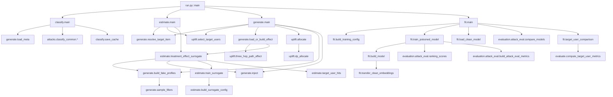

# UBA 攻击模块 —— 函数清单、数据流与输入输出

> 对象：`TPA/attacks/uba/`（Uplift-guided Budget Allocation 攻击模块）
> 生成方式：AST 静态提取（8 个 Python 文件 / **60 个顶层函数 + 2 个内嵌闭包**）+ 人工核对调用关系与产物路径
> 配套文档：[DESIGN.md](DESIGN.md)（设计取舍）、[USAGE.md](USAGE.md)（使用手册）

---

## 1. 模块分层总览

```
┌─ 编排层 ────────────────────────────────────────────────────────────────┐
│ run.py::main()        解析 --config/--mode/--tag，按阶段调用下面 4 个入口 │
└───────┬───────────────┬────────────────┬───────────────────────────────┘
        │               │                │
   classify.main   estimate.main    generate.main      fit.main
        │               │                │                │
┌───────▼───────────────▼────────────────▼────────────────▼───────────────┐
│ 纯算法层 uplift.py（不 import torch/模型）：目标用户选择 / A'³ 三跳路径 /  │
│ 分组背包 DP / 三种分配策略                                                │
└─────────────────────────────────────────────────────────────────────────┘
        │
┌───────▼─────────────────────────────────────────────────────────────────┐
│ 共享层（仓库公共代码，模块只调用不重写）                                   │
│ training/{config_utils,framework,run_tag,timing,epoch_log,metrics,paths,   │
│           modes}、evaluation/{attack_eval,metrics}、models/registry、      │
│ attacks/classify_common                                                   │
└─────────────────────────────────────────────────────────────────────────┘
```

一句话职责：

| 文件 | 职责 | 是否依赖模型代码 |
|---|---|---|
| `run.py` | CLI 编排：模式 → 阶段函数 | 间接 |
| `classify.py` | ① 物品三档分类（流行/普通/冷门）缓存 | 否 |
| `estimate.py` | ② w/ S_φ 支路：代理模型模拟实验估计处理效应 Y | **是**（torch + registry） |
| `generate.py` | ③ 预算分配 + 假档案实例化 + 注入（data 阶段） | 仅 surrogate 缓存缺失时惰性 import |
| `fit.py` | ④ 中毒训练 + 双口径评估（model 阶段） | 是 |
| `evaluate.py` | 共享评估转出 + 目标用户群指标 | 是（仅推理） |
| `uplift.py` | 纯算法：选人 / 三跳路径 / DP / 分配策略 | 否 |
| `registry.py` | `models/registry.py` 薄壳 | 间接 |

---

## 2. 端到端数据流（以 `--mode all` 为例）

```
  config.yaml ──┐
                │  run.py::load_yaml_config()
                ▼   = training.config_utils.load_config(→canonicalize) + apply_k(展开{k})
          config(dict)
                │
    ┌───────────┴───────────┬────────────────────┬─────────────────────┐
    ▼                       ▼                    ▼                     ▼
① classify            ② estimate           ③ data               ④ model
物品三档缓存         处理效应 Y           分配 T* + 注入 D_f     中毒训练 + 评测
    │                       │                    │                     │
    │ meta.pkl              │ meta.pkl           │ Y(缓存/现算)          │ meta.pkl(中毒)
    │ (干净)                │ (干净)             │ U_t + popular 池      │ stats.json
    ▼                       ▼                    ▼                     ▼
rec_freq/…json  ───►  estimate/…json  ───►  poisoned/{tag}/  ───►  outputs/{tag}/
 (filler池/类别)      (Y 矩阵)              meta.pkl+profiles+stats   ckpt+history+报告
```

### 2.1 文件级数据流（生产者 → 消费者）

| 产物（路径相对 `TPA/`） | 生产者 | 主要内容 | 消费者 |
|---|---|---|---|
| `models/{model}/data/processed/{dataset}/meta.pkl` | 模型侧预处理（模块外） | `num_users/num_items/train_pairs/test_pairs/user_items` | classify / estimate / generate / fit |
| `attacks/uba/data/rec_freq/{dataset}/{model}_top{k}.json` | `classify.main` | `counts` + `categories{popular,ordinary,cold}` + `summary` | `generate.popular_pool`（filler 池）、`generate.resolve_target_item`（category 策略）、batch 公共缓存归一化 |
| `attacks/uba/data/estimate/{dataset}/{model}/item{i}_h{H}_path_a{α}_b{β}.json` | `generate.load_or_build_effect`（现算）或 `estimate.main`（surrogate） | `effect`(∣U_t∣×(H+1))、`target_users`、`method`、参数 | `generate.main`（分配阶段） |
| `attacks/uba/data/estimate/{dataset}/{model}/item{i}_h{H}_surrogate_E{E}_k{hit_k}_s{seed}_a{α}_b{β}.json` | `estimate.main` / `load_or_build_effect` | 同上 + `per_repeat_hits`、`surrogate{}`、`seconds` | 同上 |
| `attacks/uba/data/poisoned/{dataset}/{model}/{tag}/meta.pkl` | `generate.main` | 注入后的干净+假用户 meta | `fit.main` |
| `attacks/uba/data/poisoned/{dataset}/{model}/{tag}/profiles.json` | `generate.main` | `[{fake_user,target,template_user,items}]` | 人工核对 / 复现实验 |
| `attacks/uba/data/poisoned/{dataset}/{model}/{tag}/stats.json` | `generate.main` | 预算、分配直方图、目标用户、目标物品、注入计数 | `fit.main`（读 targets / target_users / allocation） |
| `attacks/uba/data/poisoned/{dataset}/{model}/{tag}/config.yaml` | `save_config_snapshot` | 本次实验配置快照 | 复现 |
| `attacks/uba/data/poisoned/{dataset}/{model}/latest.json` | `write_latest_pointer` | `{run_tag}` | `fit.main`（分阶段运行时衔接 tag） |
| `attacks/uba/outputs/{dataset}/{model}/{tag}/checkpoints/*.pt` | `train_poisoned_model` | `latest.pt` + `{指标}-best-model.pt`（per_metric） | `fit.main --skip-train` |
| `attacks/uba/outputs/{dataset}/{model}/{tag}/history.json` | `write_history` | `{history:[{epoch,epoch_seconds,…指标}], best:{…}}` | 可视化 / batch aggregate |
| `attacks/uba/outputs/{dataset}/{model}/{tag}/checkpoints/latest.pt` | `train_poisoned_model` | 最后一轮权重 | 续训 / 对比 |
| `attacks/uba/outputs/{dataset}/{model}/{tag}/uba_comparison.md/.json` | `save_report` | 模型效用 + 目标物品 HR/NDCG + 结论（+ `allocation`、`target_users` 段） | 报告 |
| `attacks/uba/outputs/{dataset}/{model}/{tag}/target_user_metrics.md/.json` | `save_target_user_report` | 目标用户群 U_t 的 HR@K/NDCG@K（论文 Table 1 口径） | 报告 |

### 2.2 内存数据流（关键结构的形状/字段）

| 结构 | 产生位置 | 形状/字段 | 消费位置 |
|---|---|---|---|
| `meta` | `load_meta` | `{num_users:int, num_items:int, train_pairs:[(u,i)…], test_pairs:[…], user_items:{uid:set}}` | 全流程 |
| `categories/counts/summary` | `classify.main` | `{popular/ordinary/cold:[iid…]}`、`{iid:次数}`、阈值统计 | `select_target_items`、`popular_pool` |
| `Y`（处理效应矩阵） | `three_hop_path_effect` / `treatment_effect_surrogate` | `ndarray (∣U_t∣, H+1)`，`Y[r,t]` = 给第 r 个目标用户分配 t 个假用户时的估计命中 | `dp_allocate` / `_allocation_value` |
| `U_t` 信息 | `select_target_users` | `{users:[uid…], strategy, n_candidates, category_items, target_item}` | `three_hop_path_effect`、`allocate`、`stats` |
| `allocation` | `allocate` | `{strategy, target_users, allocation:{uid:t}, template_users:[uid…], num_fake_users, budget, max_per_user, estimated_value, unused_budget}` | `build_fake_profiles` → `inject` → `stats` |
| `profiles` | `build_fake_profiles` | `[{fake_user:int(组内序号), target:iid, template_user:uid, items:[iid…]}]` | `inject` → `profiles.json` |
| `poisoned_meta` | `inject` | 同 `meta`，但 `num_users += len(profiles)`、`train_pairs/user_items` 追加假用户 | `fit.train_poisoned_model` |
| `history` | `train_poisoned_model` | `[{epoch, train_loss, val_loss, …全部指标, targets:{iid:{…}}, epoch_seconds}]` | `write_history`、`history.json` |
| `report` | `compare_models` + `save_report` | `{k, model_utility:{clean,poisoned}, target_metrics:{clean:{iid:{…}},poisoned:{…}}, allocation, target_users}` | `uba_comparison.md/json` |
| `target_user_metrics` | `compute_target_user_metrics` | `{k, clean:{n_evaluated,hit_users,hr@k,ndcg@k,mean_rank_all,_users}, poisoned:{…}}` | `target_user_metrics.md/json` |

---

## 3. 逐文件函数清单（输入 / 输出 / 调用）

> 约定：**输入**=实参来源；**输出**=返回值或写盘产物；**调用**=该函数内部调用的本模块/共享函数（省略 `print/len/int` 等内建与第三方 API）。

### 3.1 `run.py`（编排入口，1 个函数）

| 函数 | 输入 | 输出 | 调用 |
|---|---|---|---|
| `main()` | CLI：`--config`（默认 `attacks/uba/config.yaml`）、`--mode ∈ {classify,estimate,data,model,both,all}`、`--tag` | `None`（副作用：按阶段调用四个 `main`；打印 `[run] mode=… run_tag=…`） | `load_yaml_config` → `training.run_tag.resolve_run_tag` → `training.modes.stages_for_mode` → `classify_main` / `estimate_main` / `gen_main` / `fit_main` |

模式 → 阶段映射（`estimate` 是本模块自定义阶段）：

| mode | classify | estimate | data | model |
|---|---|---|---|---|
| `classify` | ✔ | | | |
| `estimate` | | ✔ | | |
| `data` | | | ✔ | |
| `model` | | | | ✔ |
| `both` | | | ✔ | ✔ |
| `all` | ✔ | ✔ | ✔ | ✔ |

### 3.2 `classify.py`（5 个函数）

| 函数 | 输入 | 输出 | 调用 |
|---|---|---|---|
| `rec_freq_dir(config)` | `config['dataset']` | `Path: attacks/uba/data/rec_freq/{dataset}` | — |
| `rec_freq_path(config, model_name, k)` | dataset / model / k | `Path: …/{model}_top{k}.json` | `rec_freq_dir` |
| `save_cache(config, model_name, k, counts, categories, summary)` | 计数与分类结果 | 写 JSON 缓存，返回 `Path` | `rec_freq_path` |
| `load_cache(config, model_name, k, required=False)` | dataset/model/k | `dict`（`counts` 的 key 转回 int）或 `None`；`required=True` 且缺失→`FileNotFoundError` | `rec_freq_path` |
| `main(config)` | 完整 config；读 `meta.pkl` | `{'counts','categories','summary','cache_path'}`，并写分类缓存 | `load_meta`(generate) → `attacks.classify_common.{interaction_counts, classify_by_interaction_counts}` → `save_cache` |

### 3.3 `uplift.py`（纯算法，12 个顶层函数 + 1 个内嵌闭包）

| 函数 | 输入 | 输出 | 调用 |
|---|---|---|---|
| `interaction_sets(pairs, max_uid=None)` | `[(u,i)…]`，`max_uid` 用于剔除假用户 | `{uid: {iid}}` | — |
| `item_interaction_sets(pairs, max_uid=None, num_items=None)` | 同上 | `{iid: {uid}}`（物品倒排） | — |
| `accessible_template_users(meta, ratio=1.0, seed=42)` | meta | `[uid…]`（可访问模板池，`random_all` 用） | `random.Random(seed).sample` |
| `cooccurrence_neighbors(user_items, target_item, size)` | 用户-物品集合、目标物品、邻域大小 | `[iid…]`（含目标物品自身，按共现降序） | — |
| `select_target_users(meta, target_item, cfg, seed)` | meta、目标物品、`attack.uba.target_users` 段 | `{users, strategy, n_candidates, category_items, target_item}` | `cooccurrence_neighbors`、`rng.sample` |
| `_clean_adjacency(user_items, num_users, num_items)` | 真实交互 | `csr_matrix D_r (M×N)` | `csr_matrix` |
| `_fake_adjacency(templates, user_items, profile_fn, target_item, num_items)` | 模板用户序列 + 画像函数 | `csr_matrix F (K×N)`（每行一个假用户，必含目标物品） | `profile_fn`、`csr_matrix` |
| `three_hop_path_counts(d_plus, target_rows, target_item)` | `D'` 稀疏矩阵、目标用户行号 | `ndarray (∣U_t∣,)`：`(A'³)_{u,i}` | `d_plus[rows].dot(d_plus.T).dot(col)` |
| `three_hop_path_effect(user_items, target_users, target_item, max_per_user, num_items, num_users=None, alpha=1.0, beta=1.0, profile_fn=None, rng=None)` | 干净交互 + 目标用户 | `ndarray (∣U_t∣, H+1)`：`Y=α·((A')³)^β` | `_clean_adjacency`、`_fake_adjacency`、`sparse_vstack`、`three_hop_path_counts` |
| └ `profile_fn(uid)`（内嵌闭包，`profile_fn=None` 时启用） | 模板/目标用户 uid | `[iid…]`（默认画像 = 该用户历史交互，即"最相似模板"） | — |
| `dp_allocate(values, budget, max_per_user)` | `Y(B,H+1)`、预算 N、单用户上限 H | `(T*: ndarray (∣U_t∣,) int, best_value: float)` | — （纯 DP） |
| `_allocation_value(values, users, allocation)` | `Y` + 分配方案 | `float`（按 Y 累加的估计收益） | — |
| `allocate(values, target_users, strategy, budget, max_per_user, seed=42, template_pool=None, rng=None)` | `Y`、U_t、策略、预算 | `{strategy, target_users, allocation, template_users, num_fake_users, budget, max_per_user, estimated_value, unused_budget}` | `dp_allocate`（uba）、`_allocation_value`、`rng.choices`（random_all） |

### 3.4 `generate.py`（data 阶段，24 个顶层函数 + 1 个内嵌闭包）

| 函数 | 输入 | 输出 | 调用 |
|---|---|---|---|
| `load_yaml_config(path)` | config 路径 | canonical + `{k}` 展开后的 `dict` | `training.config_utils.{load_config, apply_k}` |
| `raw_meta_path(config, model_name=None)` | config | `Path`（优先受害模型 processed，缺失回退 lightgcn） | — |
| `load_meta(meta_path)` / `save_meta(meta, out)` | 路径 / meta | `dict` / 写盘 | `pickle` |
| `save_json(obj, out_path)` | 任意可序列化对象 | 写 UTF-8 JSON | `json.dump` |
| `compute_item_popularity(train_pairs)` | `[(u,i)…]` | `Counter{iid: 次数}` | — |
| `select_target_items(popularity, num_items, strategy, count, ids, rng, categories=None, category='cold', rec_counts=None)` | 流行度 + 策略 | `[iid…]` | `rng.sample` |
| `estimate_dir(config, model_name)` | config | `Path: attacks/uba/data/estimate/{dataset}/{model}` | — |
| `effect_cache_path(config, model_name, target_item, method, repeats, hit_k, alpha, beta, seed)` | 目标物品 + 会改变 Y 的参数 | `Path`（文件名编码 method/H/E/k/seed/α/β） | `estimate_dir`、`treatment_cfg` |
| `treatment_cfg/profile_cfg/allocation_cfg/target_users_cfg(config)` | config | `attack.uba.{treatment,profile,allocation,target_users}`（缺失时 `treatment_cfg` 报错） | — |
| `_effect_profile_fn(filler_source, filler_size, user_items, num_items, popular_items, rng)` | 画像参数 | `profile_fn(template_user) -> [iid…]`（供三跳路径用，保证 Y 与真实注入同规则） | `sample_fillers` |
| └ `profile_fn(template_user)`（内嵌闭包） | 模板用户 uid | `[iid…]`（按 `filler_source` 采样的 filler） | `filler_pool`、`sample_fillers` |
| `load_or_build_effect(config, meta, target_item, target_users, model_name, popular_items=None)` | meta + U_t | `{method, target_item, target_users, max_per_user, α, β, …, effect: ndarray}`；命中缓存则直读，否则现算并写盘 | `effect_cache_path`、`three_hop_path_effect`（path）、惰性 `estimate.treatment_effect_surrogate`、`save_json` |
| `_effect_from_json(payload)` | 缓存 JSON | `ndarray` | `np.asarray` |
| `popular_pool(config, model_name, meta)` | config + meta | `[iid…]`（classify 的 popular 档；缺失回退训练集热门） | `classify.load_cache`、`compute_item_popularity` |
| `filler_pool(filler_source, template_user, user_items, popular_items, num_items)` | 画像来源 + 模板用户 | `[iid…]`（候选池） | — |
| `sample_fillers(pool, filler_size, fallback, rng)` | 池 + 数量 | `[iid…]`（无放回；池不足用 fallback 补齐） | `rng.sample`、`rng.shuffle` |
| `build_fake_profiles(template_users, target_item, filler_size, filler_source, user_items, num_items, popular_items, rng)` | 模板用户序列（长度=假用户数） | `[{fake_user, target, template_user, items}]`（items 去重 + 目标物品恰好一次） | `filler_pool`、`sample_fillers` |
| `inject(meta, profiles)` | 干净 meta + 画像 | 中毒 meta（新 `train_pairs/user_items`，`num_users` 增大；不改入参） | — |
| `allocation_histogram(allocation)` | `{uid:t}` | `{str(t): 用户数}` | — |
| `resolve_target_item(config, meta, model_name, rng=None)` | config + meta | `{item_id, popularity, rec_cache}`（`count!=1` 直接报错） | `compute_item_popularity`、`classify.load_cache`、`select_target_items` |
| `main(config, raw_meta=None, out_dir=None)` | config（可注入 meta 路径与输出目录） | `stats` dict；写 `meta.pkl / profiles.json / stats.json / config.yaml / latest.json` | `load_meta`、`resolve_target_item`、`select_target_users`、`popular_pool`、`load_or_build_effect`、`accessible_template_users`、`allocate`、`build_fake_profiles`、`inject`、`allocation_histogram`、`resolve_run_tag`、`save_config_snapshot`、`write_latest_pointer` |

### 3.5 `estimate.py`（w/ S_φ 支路，6 个函数）

| 函数 | 输入 | 输出 | 调用 |
|---|---|---|---|
| `build_surrogate_config(config, dataset)` | config + 代理名 | `TrainingConfig`（代理自身 config 默认 ← `surrogate.training` 覆盖） | `registry.load_model_config`、`TrainingConfig` |
| `_split_train_val(pairs, seed)` | 交互对 + 种子 | `(train, val)` 95/5 | `random.Random.shuffle` |
| `train_surrogate(config, poisoned_meta, seed)` | 中毒 meta + 种子 | 训练好的代理模型实例 | `build_surrogate_config`、`registry.get_model_cls/get_dataset_cls`、`DataLoader`、`model.train_step`、`load_state_dict`（可选热启动） |
| `target_user_hits(model, clean_user_items, target_users, target_item, hit_k, batch_size=512)` | 代理模型 + 目标用户 | `ndarray (∣U_t∣,)` 0/1（是否进入 Top-hit_k；过滤干净训练集已见物品） | `model.get_user_embeddings/get_item_embeddings`、`torch.topk` |
| `treatment_effect_surrogate(config, meta, target_item, target_users)` | 干净 meta + U_t | `{method:'surrogate', effect:(∣U_t∣,H+1), per_repeat_hits, hit_k, repeats, surrogate{}, seconds}` | 双层循环：`build_fake_profiles` → `inject` → `train_surrogate` → `target_user_hits` → 均值 |
| `main(config, meta=None)` | config（可注入 meta） | payload dict；写 estimate 缓存 JSON | `raw_meta_path`、`load_meta`、`resolve_target_item`、`select_target_users`、`treatment_effect_surrogate`、`effect_cache_path`、`save_json` |

### 3.6 `evaluate.py`（3 个函数 + 共享转出）

| 函数 | 输入 | 输出 | 调用 |
|---|---|---|---|
| `compute_target_user_metrics(scores, user_ids, clean_user_items, target_users, target_item, k, device=None)` | 全量排序分数 + 目标用户 | `{target_item,k,n_target_users,n_evaluated,hit_users,hr@k,ndcg@k,mean_rank,mean_rank_all,_users}` | `torch.topk`、`masked_fill`（过滤干净训练集已见） |
| `format_target_user_report(metrics)` | clean/poisoned 指标 | Markdown 字符串 | — |
| `save_target_user_report(metrics, out_dir)` | 指标 + 输出目录 | 写 `target_user_metrics.md/.json`，返回 md 路径 | `format_target_user_report` |
| 转出（`from evaluation.attack_eval import …`） | — | `ranking_scores / compute_target_metrics / aggregate_target_metrics / build_attack_eval_metrics / compare_models / format_report / save_report` | 共享层 |

### 3.7 `fit.py`（model 阶段，9 个函数）

| 函数 | 输入 | 输出 | 调用 |
|---|---|---|---|
| `build_training_config(config, dataset, model_name='lightgcn')` | 攻击 config | `TrainingConfig`（模型默认 < `training` 段 < `model.overrides`） | `registry.load_model_config`、`TrainingConfig` |
| `resolve_metrics_cfg(config, model_name)` | 攻击 config | `evaluation.metrics` 列表（缺省取模型自身 config） | `load_model_config` |
| `transfer_clean_embeddings(model, ckpt_path, clean_num_users, num_fake_users)` | 中毒模型 + 干净 ckpt | `None`（就地写入：原用户行不变、物品行整体偏移 n_fake、假用户行随机） | `torch.load`、断言行数 |
| `build_model(cfg, meta, model_cls, warm_start, warm_ckpt, clean_num_users=None)` | meta + 模型类 | 模型实例（可选 warm-start） | `model_cls(...)`、`transfer_clean_embeddings` |
| `_split_train_val(pairs, seed=42)` | 交互对 | `(train, val)` 95/5 | `random.Random.shuffle` |
| `train_poisoned_model(cfg, poisoned_meta, out_dir, warm_start, warm_ckpt, clean_num_users, model_cls, dataset_cls, metrics_cfg, checkpoint_mode='per_metric', targets=None, clean_user_items=None)` | 中毒 meta + 训练配置 | `(model, history)`；写 `checkpoints/{指标}-best-model.pt`、`latest.pt`、`history.json` | `BestTracker`、`build_model`、`DataLoader`、`ranking_scores`、`build_attack_eval_metrics`、`log_train_line/log_eval_line`、`section_enter/exit`、`write_history`；WMF 分支走 `models.wmf.train.train_wmf_from_meta` |
| `load_clean_model(cfg, clean_meta, ckpt_path, model_cls)` | 干净 ckpt | 干净模型实例（仅评测用） | `build_model`、`load_state_dict` |
| `target_user_comparison(clean_model, poisoned_model, clean_meta, poisoned_meta, target_users, target_item, k)` | 两个模型 + 目标用户 | `{k, clean:{…}, poisoned:{…}}` | `ranking_scores`、`compute_target_user_metrics` |
| `main(config, skip_train=False, tag=None)` | config（可 `--skip-train` / `--tag`） | `report` dict；写 `uba_comparison.md/json`、`target_user_metrics.md/json` | `resolve_run_tag` / `read_latest_tag`（无 tag 时衔接 data 阶段）、`load_meta`、`build_training_config`、`resolve_metrics_cfg`、`resolve_from_root`、`train_poisoned_model` 或 `build_model`+`load_state_dict`、`load_clean_model`、`compare_models`、`save_report`、`target_user_comparison`、`save_target_user_report` |

### 3.8 `registry.py` / `__init__.py`

| 项 | 内容 |
|---|---|
| `registry.py` | 薄壳转出：`AVAILABLE_MODELS / get_model_cls / get_dataset_cls / get_model_entry / load_model_config`（单一事实来源在 `models/registry.py`） |
| `__init__.py` | 模块 docstring：声明 6 个文件的职责与阶段划分（无函数） |

---

## 4. 阶段契约与验证门禁

| 阶段 | 入口 | 必备输入 | 必备输出 | 模块内断言/报错 |
|---|---|---|---|---|
| classify | `classify.main` | `meta.pkl` | `rec_freq/{model}_top{k}.json` | `classify_common` 校验 `0<popular_ratio<medium_ratio≤1`；缓存缺失时 `load_cache(required=True)` 抛 `FileNotFoundError` |
| estimate | `estimate.main` | `meta.pkl` + `surrogate.enabled=true` | `estimate/…surrogate….json` | `repeats>0`；`surrogate.enabled=false` → `ValueError`；代理无 `train_step` → `ValueError` |
| data | `generate.main` | `meta.pkl`（+ 可选 classify / estimate 缓存） | `poisoned/{tag}/{meta.pkl,profiles.json,stats.json,config.yaml}` + `latest.json` | `count!=1`→`ValueError`；预算≤0→`ValueError`；`after−before == Σ∣items∣`；画像数 == 分配出的假用户数；每画像目标物品恰好 1 次；假 uid 不越界；Y 形状 == (∣U_t∣,H+1) |
| model | `fit.main` | `poisoned/{tag}/meta.pkl` + `stats.json` + 干净 ckpt | `outputs/{tag}/{config.yaml,checkpoints/,history.json,uba_comparison.*,target_user_metrics.*}`（`eval_log.csv` 见 §9.1 偏差说明） | 中毒 meta 缺失→`FileNotFoundError`；warm-start 断言干净嵌入行数 == `clean_num_users+num_items` 且 `emb_dim` 一致；`BestTracker` 指标名与配置不匹配→`ValueError` |

---

## 5. 调用关系图（函数级）



---

## 6. CLI → 函数 → 产物 对照表

| 命令 | 调用链 | 产物 |
|---|---|---|
| `python attacks/uba/run.py --mode classify` | `run.main` → `classify.main` → `load_meta` → `classify_common` → `save_cache` | `data/rec_freq/{dataset}/{model}_top{k}.json` |
| `--mode estimate` | `run.main` → `estimate.main` → `resolve_target_item` → `select_target_users` → `treatment_effect_surrogate`（→ `build_fake_profiles`/`inject`/`train_surrogate`/`target_user_hits`）→ `save_json` | `data/estimate/{dataset}/{model}/…surrogate….json` |
| `--mode data` | `run.main` → `generate.main` → `resolve_target_item` → `select_target_users` → `load_or_build_effect` → `allocate` → `build_fake_profiles` → `inject` → 断言 → `save_*` | `data/poisoned/{dataset}/{model}/{tag}/…` + `latest.json` |
| `--mode model` | `run.main` → `fit.main` → `build_training_config` → `train_poisoned_model` → `load_clean_model` → `compare_models` → `save_report` → `target_user_comparison` → `save_target_user_report` | `outputs/{dataset}/{model}/{tag}/…` |
| `--mode both / all` | 上述组合 | 上述组合 |
| `python attacks/uba/classify.py` / `generate.py` / `fit.py` / `estimate.py` | 各自文件的 `__main__` → `load_yaml_config` → 对应 `main` | 同上（单阶段） |

---

## 7. 外部依赖函数（模块调用但不拥有）

| 来源 | 被谁调用 | 作用 |
|---|---|---|
| `attacks.classify_common.{interaction_counts, classify_by_interaction_counts}` | `classify.main` | 交互数统计与三档划分（仓库统一口径） |
| `training.config_utils.{load_config, apply_k}` | `generate.load_yaml_config` | canonical 化 + `{k}` 展开 |
| `training.framework.TrainingConfig` | `estimate.build_surrogate_config`、`fit.build_training_config` | 模型超参容器 |
| `training.run_tag.{resolve_run_tag, read_latest_tag, save_config_snapshot, write_latest_pointer}` | `generate.main`、`fit.main` | run_tag 隔离、配置快照、latest 指针 |
| `training.timing.{timed, section_enter, section_exit}` | 各阶段入口 | 阶段/epoch 计时打印 |
| `training.epoch_log.{log_train_line, log_eval_line, write_history}` | `fit.train_poisoned_model` | 每 epoch 输出与 history.json 规范 |
| `training.metrics.{BestTracker, eval_ks_from_metrics, safe_checkpoint_name}` | `fit.train_poisoned_model`、`fit.main` | 多指标最优 checkpoint 与方向解析 |
| `training.paths.resolve_from_root` | `fit.main` | 配置里的相对路径 → 仓库根 |
| `training.modes.stages_for_mode` | `run.main` | `classify/data/model` 阶段选择 |
| `evaluation.attack_eval.*` | `fit.main`、`fit.train_poisoned_model`、`evaluate.py` | 全量排序、目标指标、对比报告 |
| `evaluation.metrics.compute_metrics` | 经 `attack_eval` 间接使用 | recall@K / ndcg@K（模型效用） |
| `models.registry.*` | `registry.py`、`estimate`、`fit` | 模型/数据集类与默认配置解析 |
| `models.lightgcn.dataset.LightGCNDataset` | `fit.main`（缺省 dataset_cls） | 模型无自带 dataset 时的回退 |
| `models.wmf.train.train_wmf_from_meta` | `fit.train_poisoned_model`（WMF 分支） | 纯 ALS 模型的全量训练路径 |

---

## 8. 阅读顺序建议

1. 想了解"一次实验怎么跑"：§2 数据流 → §6 CLI 对照表；
2. 想改算法：`uplift.py`（§3.3）→ `generate.py` 的 `load_or_build_effect` / `build_fake_profiles`；
3. 想换后端攻击者画像：只改 `generate.filler_pool` / `sample_fillers`（`filler_source` 三态）；
4. 想换 victim/代理模型：`fit.build_training_config` + `registry.py`（**不要**改 `models/*`）；
5. 想加新阶段（如新的处理效应估计）：仿 `estimate.py`，在 `run.py` 加模式分支，并在 `USAGE.md` 说明。

---

## 9. 已知偏差、边界与注意事项

### 9.1 与仓库产物标准的偏差（**待办，本次仅记录不改代码**）

| 项 | 仓库标准（AGENTS §3 输出与产物规范） | UBA 现状 | 影响 |
|---|---|---|---|
| `eval_log.csv` | 每个 epoch 的 `[eval]` 行 + `history.json` + **`eval_log.csv`** 输出该轮全部指标 | **未写** `eval_log.csv`；已有控制台 `[eval]` 行与 `history.json`（含每轮全部指标 + `epoch_seconds`） | 需要 CSV 形态曲线时缺失；画图可用 `history.json` 替代 |

> 现状与仓库其它攻击模块一致（`bandwagon / random / tpa / pgd` 的 `fit.py` 同样只写 `history.json`），
> `eval_log.csv` 目前只由 `models/*/train.py` 与 `training/epoch_log.py::write_eval_log` 提供。
> 若要对齐标准，最小改动是在 `fit.train_poisoned_model` 的 `write_history` 后补一行
> `write_eval_log(out_dir, history, list(tracker.directions))`（`training/epoch_log.py` 已提供该函数）。

### 9.2 实现边界

1. **单目标物品**：`resolve_target_item` 对 `attack.target_items.count != 1` 直接报错（多目标需跨物品联合分配，未实现）。
2. **estimate 缓存键**：文件名编码 `method/H/E/hit_k/seed/α/β`；改这些参数会**另建**缓存文件，不会互相覆盖；要强制重算就删除 `data/estimate/{dataset}/{model}/` 下对应文件。
3. **path 支路的自动补算**：`generate.main` 在 `method=path` 且无缓存时会现算并写盘（纯 numpy/scipy）；`method=surrogate` 且无缓存时惰性 import `estimate.py` 现算（很慢），因此批量跑建议先 `--mode estimate`。
4. **WMF victim 分支**：`train_poisoned_model` 检测到 `WMFModel` 时改走 `models.wmf.train.train_wmf_from_meta`（全量 ALS 语义，不走 mini-batch，也不做嵌入 warm-start）。
5. **`--skip-train` 加载顺序**：`{首个指标}-best-model.pt` → `best.pt`（旧） → `latest.pt`。
6. **假用户 uid**：始终从 `num_users` 起连续编号，注入时同步扩展 `train_pairs` 与 `user_items`；`interaction_sets(..., max_uid=num_users)` 保证所有真实用户统计不被假用户污染。
7. **`random_all` 的 `estimated_value` 为 `nan`**：该策略不按目标用户口径估值（无 Y 加权），属预期行为，`stats.json` 中该字段不参与任何判定。

### 9.3 实测产物样例（ml100k / lightgcn / tag=uba-smoke，用于对照本文档）

```
attacks/uba/data/rec_freq/ml100k/lightgcn_top10.json
attacks/uba/data/estimate/ml100k/lightgcn/item251_h6_path_a1_b1.json
attacks/uba/data/poisoned/ml100k/lightgcn/latest.json
attacks/uba/data/poisoned/ml100k/lightgcn/uba-smoke/{config.yaml,meta.pkl,profiles.json,stats.json}
attacks/uba/outputs/ml100k/lightgcn/uba-smoke/
    ├── config.yaml
    ├── history.json                 # {history:[{epoch,train_loss,val_loss,target_ndcg@10,
    │                                #   target_hr@10,recall@10,ndcg@10,targets,epoch_seconds}],
    │                                #  best:{指标:{epoch,value,metrics,checkpoint}}}
    ├── uba_comparison.md / .json    # 模型效用（投毒代价）+ 目标物品 HR/NDCG + allocation/target_users
    ├── target_user_metrics.md/.json # 目标用户群 U_t 口径（论文 Table 1）
    └── checkpoints/{latest.pt, {{指标}}-best-model.pt × 4}
```

对应 `stats.json` 顶层键（实测）：
`allocation, attack, budget, dataset, filler_size, filler_source, injected_pairs, k, max_per_user, model, num_fake_users, num_users_after, num_users_before, run_tag, seed, target_users, targets, train_pairs_after, train_pairs_before, treatment`
